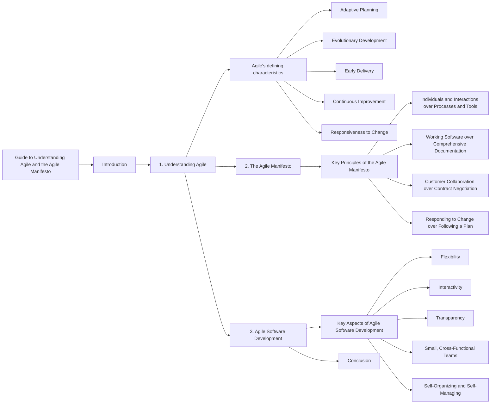

# What-is-Agile

1️⃣  Value #1: Individuals and interactions

Successful teams prioritize finding the right people and making sure they communicate frequently. Good tools and processes help, but focusing on the individuals and their interactions will yield the best results.

For example, the world's best guitar is useless to someone that doesn't know how to play it. Making a beautiful song (or product) requires highly skilled people that can collaborate effectively.

Your team should do the same: prioritize people and communicate often. Frequent discussions across the team help uncover critical information to keep the work moving forward.

---

2️⃣  Value #2: Working software

Successful teams prioritize delivering a product that works. Not to make it perfect. This value applies to any work you deliver to customers, not just software.

Before agile, teams would try to build against the full scope of project requirements, allowing very little flexibility.

Instead, your team should look for a few critical features to deliver as a  Minimum Viable Product  (or MVP). Then, the team should prioritize building the MVP and get it in the customers' hands as quickly as possible.

This practice gives customers a working product. And it allows your team to get real-time feedback to improve future iterations.

---

3️⃣   Value #3: Customer collaboration

Successful teams prioritize frequent collaboration with stakeholders and customers. Think of your customers as partners, working closely to design the best solution.

Before agile, teams would spend a lot of time detailing a final product before the work started. The problem was that these original details rarely ended up providing much value in the end.

Instead, you should partner closely with your customer throughout the process and be ready to adapt to changing needs and requirements. Gather feedback frequently to help your customers quickly solve their highest priority problems.

---

4️⃣  Value #4: Responding to change

Successful teams stay flexible and ready to adapt to unforeseen changes. Starting with a plan is always a good idea. But don't be overly rigid in sticking to it.

It's important to recognize in work (and life) that change is the only constant. Markets, teams, projects, and situations are constantly in flux. 

You and your team will be most successful if you prepare your mind for constant changes, and be ready to make intelligent pivots on a whim.

---

Our highest priority is to satisfy the customer through early and continuous delivery of valuable software.
Welcome changing requirements, even late in development. Agile processes harness change for the customer's competitive advantage.
Deliver working software frequently, from a couple of weeks to a couple of months, with a preference to the shorter timescale.
Business people and developers must work together daily throughout the project.
Build projects around motivated individuals. Give them the environment and support they need, and trust them to get the job done.
The most efficient and effective method of conveying information to and within a development team is face-to-face conversation.
Working software is the primary measure of progress.
Agile processes promote sustainable development. The sponsors, developers, and users should be able to maintain a constant pace indefinitely.
Continuous attention to technical excellence and good design enhances agility.
Simplicity--the art of maximizing the amount of work not done--is essential.
The best architectures, requirements, and designs emerge from self-organizing teams.
At regular intervals, the team reflects on how to become more effective, then tunes and adjusts its behavior accordingly.

---

✅   1.  Show respect for all team members

Healthy, high-performing teams create a culture of trust and mutual respect. That's the backbone of agility. 

Having an agile mindset means you embrace different ways of thinking and working, even if you don't always agree with them. Focus on keeping an open mind and seeking to understand new and unexpected ideas.

✅   2.  Communicate openly and clearly

Share updates. Ask questions. Be open and transparent at all times. With each interaction, challenge yourself to communicate clearly and concisely. 

Encourage your team to engage in frequent discussions. Quality discussions can reveal critical information that moves the work forward and helps the team feel more connected.

✅  3.  Look for ways to innovate

Agility is all about delivering maximum value to customers. When a customer's needs change, you need to respond quickly with an innovative solution.

Having an agile mindset means you're constantly looking for opportunities to innovate. This could mean improving your team's internal processes. Or enhancing features of the product you're building.

As you complete your daily tasks, think if there are ways to improve what you're doing. Analyzing and improving your team's work will be valuable for your future career.

✅   4.  Actively improve your skills

Agile is all about continuous improvement. In your daily work, always look for opportunities to learn and grow your skillset.

Pause for a minute and think about your current skills: Which skills seem to be most valuable? Which skills mesh well with your natural tendencies? Use these questions as a starting point to help you plan which skills to sharpen.

Prioritizing your skill development is always a good idea. Not only does it help your team, but it also improves your future career opportunities.

✅   5.  Your work doesn't have to be perfect

Your goal is to deliver something that works; an MVP. Not to make every detail perfect.

Shift your mindset to focus on doing "good enough" work, and then get immediate feedback to improve the next version. Try to adopt this approach for both large and small tasks.

"Good enough" is different for every team and every project. If the parameters are not clear, you may want to discuss them with your team leader.

✅   6.  Have a plan, but always be ready to pivot

An agile mindset is about being flexible and ready for any unpredictable change. Yes, you should always have a Plan A (and B and C, if time allows). But you'll be most successful at work if your mind is always prepared to pivot.

Change will come. It always does. Your job is to prepare your brain to stay calm and collected so that you can handle each emotional wave with ease. If everyone on the team is ready for change, you'll be able to bounce back quickly and refocus energy on solving new problems.

---

# Guide to Understanding Agile and the Agile Manifesto

## Introduction
Agile is an iterative approach to project management that focuses on responsiveness and delivering value quickly to customers. This guide will provide an overview of Agile, its defining characteristics, and explain the philosophy behind the Agile Manifesto.

## 1. Understanding Agile
Agile is an iterative project management approach that emphasizes small increments of work and continuous feedback from customers. Unlike traditional planning methods, Agile allows for adaptive planning and evolving development.

- Agile's defining characteristics:
  - Adaptive Planning: Rather than planning an entire year's worth of work, Agile focuses on planning small iterations to deliver value and receive feedback from customers.
  - Evolutionary Development: Agile promotes building software in small increments and evolving it over time based on customer feedback.
  - Early Delivery: Agile emphasizes the importance of delivering iterations to customers early to obtain valuable feedback for improvement.
  - Continuous Improvement: Agile enables teams to continuously improve both their work processes and the product by incorporating customer feedback.
  - Responsiveness to Change: Agile allows teams to respond quickly to changing requirements and adapt their plans based on customer needs.

## 2. The Agile Manifesto
The Agile Manifesto is a set of principles that guide Agile software development. It values certain aspects more than others to ensure customer satisfaction and flexibility throughout the development process.

- Key Principles of the Agile Manifesto:
  - Individuals and Interactions over Processes and Tools: Prioritizing effective communication and collaboration among team members and with customers rather than relying solely on processes and tools.
  - Working Software over Comprehensive Documentation: Placing more importance on delivering functional software rather than extensive documentation.
  - Customer Collaboration over Contract Negotiation: Emphasizing the collaboration and active involvement of customers in the development process, instead of focusing solely on contractual agreements.
  - Responding to Change over Following a Plan: Valuing the ability to respond and adapt to changing requirements instead of strictly adhering to a predefined plan.

## 3. Agile Software Development
Agile software development aligns with the principles of the Agile Manifesto. It emphasizes keeping the core values in mind while focusing on flexibility, interactivity, and transparency.

- Key Aspects of Agile Software Development:
  - Flexibility: Agile teams embrace change and adapt their plans and development process accordingly.
  - Interactivity: Effective communication and collaboration among team members and customers are crucial for successful Agile development.
  - Transparency: Agile teams promote transparency by ensuring that everyone knows what others are working on and fostering a sense of responsibility towards delivering value to customers.
  - Small, Cross-Functional Teams: Agile teams are composed of small, co-located, cross-functional members who work together to achieve project goals.
  - Self-Organizing and Self-Managing: Agile teams have autonomy and take ownership of their work, organizing themselves to maximize productivity and efficiency.

## Conclusion
Agile is an iterative and collaborative approach to software development that values customer satisfaction and flexibility. The Agile Manifesto outlines the core principles that guide Agile development, emphasizing the importance of individuals, working software, customer collaboration, and responsiveness to change. By implementing Agile methodologies and embracing its core values, teams can deliver high-quality software that meets evolving customer needs.

# Guide to Waterfall, Extreme Programming, and Kanban in Software Development

## Introduction
In software development, different approaches and methodologies are used to manage projects and deliver high-quality software. This guide explores the Waterfall approach, the Extreme Programming (XP) approach, and the Kanban methodology. We will discuss the problems with the Waterfall approach, explain the principles and values of XP, and define Kanban along with its core principles.

## 1. Waterfall Approach
The Waterfall approach is a traditional, sequential method of software development that follows a linear progression from one phase to another. Here is a breakdown of the typical Waterfall process:

1. Requirements Phase: Gathering and documenting all the customer's requirements for the system.
2. Design Phase: Creating a detailed design based on the gathered requirements.
3. Coding Phase: Writing the actual code based on the design.
4. Integration Phase: Combining the separate modules or components to form a working system.
5. Testing Phase: Evaluating the system to identify and fix any bugs or issues.
6. Deployment Phase: Releasing the software to the production environment.

### Problems with the Waterfall Approach:
- Lack of Change Provision: The Waterfall approach has no provision for accommodating changes once a phase is completed, leading to inflexibility.
- Limited Feedback and Delivery: Intermediate deliverables are not provided until the final deployment phase, making it difficult to assess progress and gather feedback from customers.
- Information Loss and Blocking: Passing work from one phase to another increases the risk of losing information and creating bottlenecks if the subsequent phase cannot accept the work.
- Costly Mistake Corrections: Discovering mistakes or design flaws late in the process can be expensive and time-consuming to rectify.
- Long Lead Times: The entire development process, from initial requirements to deployment, can have lengthy lead times, resulting in delayed software delivery.

## 2. Extreme Programming (XP) Approach
Extreme Programming (XP) is an Agile software development methodology introduced in 1996 by Kent Beck. It is an iterative approach that emphasizes frequent feedback, collaboration, and responsiveness to change. The key values of XP are:

1. Simplicity: Delivering only what is necessary and avoiding unnecessary complexity.
2. Communication: Encouraging open and frequent communication among team members.
3. Feedback: Establishing feedback loops to continuously assess progress and make improvements.
4. Respect: Valuing each team member's opinions, expertise, and contributions.
5. Courage: Being honest about capabilities and commitments, and embracing change when necessary.

XP operates within short iterations or cycles, with a focus on continuous improvement, customer involvement, and delivering high-quality software incrementally.

## 3. Kanban Methodology
Kanban is a visual and lean methodology derived from the Japanese manufacturing system. It promotes a continuous flow of work and emphasizes efficiency and productivity. The core principles of Kanban are:

1. Visualize the Workflow: Creating a visual representation of the work process to enhance understanding and transparency.
2. Limit Work in Progress (WIP): Restricting the number of tasks or items in progress at any given time to prevent bottlenecks and improve flow.
3. Manage and Enhance Flow: Analyzing and optimizing the workflow to improve efficiency and reduce lead times.
4. Make Policies Explicit: Defining clear guidelines and rules for how work is done and what constitutes completion.
5. Continuously Improve: Encouraging regular reflection, feedback, and adaptation to drive ongoing improvement and innovation.

Kanban boards are often used to visualize work items, track progress, and facilitate collaboration within Agile teams.

## Conclusion
Understanding different software development approaches is essential for selecting the most suitable methodology for a given project. The Waterfall approach, although structured, can lead to

 inflexibility, delayed feedback, and costly corrections. On the other hand, Extreme Programming (XP) emphasizes iterative development, customer collaboration, and continuous improvement. Kanban, derived from lean manufacturing principles, focuses on visualizing workflow, limiting work in progress, and optimizing flow. Each approach offers unique advantages and can be adapted to various project requirements and team dynamics.

By incorporating Agile methodologies like XP and Kanban, software development teams can enhance collaboration, responsiveness, and overall project success.

---

# Agile and Scrum: A Comprehensive Guide

This guide will help you understand the key differences between Agile and Scrum, define the characteristics of the Scrum methodology, and describe the step-by-step process of implementing Scrum.

## Agile vs. Scrum

Agile and Scrum are often used interchangeably, but it's essential to recognize their distinctions. Agile is a philosophy that provides a flexible approach to work, while Scrum is a specific methodology within the Agile framework that offers a more structured process for working in an agile manner.

### Agile

Agile is a philosophy for doing work that promotes flexibility, adaptability, and collaboration. It emphasizes iterative and incremental development, customer collaboration, and rapid responses to change. Agile does not prescribe specific processes but encourages teams to find the most effective way to deliver value.

### Scrum

Scrum is a management framework designed for incremental product development within an Agile environment. It focuses on small, cross-functional, self-managing teams and provides a structure of roles, rules, and artifacts to guide the development process. Scrum utilizes fixed-length iterations called sprints to deliver potentially shippable increments of the product.

## The Scrum Process

The Scrum process consists of several key steps that ensure effective product development. Let's explore each of these steps in detail:

1. **Product Backlog:** The product backlog is an exhaustive list of all the desired features, enhancements, and improvements for the product. It serves as a comprehensive to-do list for the development team.

2. **Backlog Refinement:** During backlog refinement, the team reviews and analyzes the items in the product backlog to ensure they are "sprint ready." This involves clarifying requirements, breaking down larger tasks, and estimating effort for each item.

3. **Planning Meeting:** In the planning meeting, the team selects a subset of items from the product backlog to form the sprint backlog. The sprint backlog includes only the stories and tasks to be accomplished during the upcoming sprint, typically lasting two weeks.

4. **Sprint Execution:** The team works on the selected items from the sprint backlog for the duration of the sprint. Daily Scrum or stand-up meetings are conducted to synchronize activities, address any challenges, and provide updates on progress. Each team member answers three questions: What did you do yesterday? What are you going to do today? Are there any obstacles in your way?

5. **Sprint Review:** At the end of each sprint, a sprint review is conducted to showcase the work completed during the iteration. Feedback is gathered from stakeholders, and the product owner verifies if the increment meets the desired objectives.

6. **Sprint Retrospective:** The sprint retrospective is a team reflection session to assess what went well, identify areas for improvement, and plan actions for the next sprint. This feedback loop ensures continuous learning and optimization.

7. **Agile Iterations:** Agile development is an iterative process that repeats the design, code, test, and deploy cycle. The product evolves through repeated iterations, incorporating customer feedback and continuously delivering value.

## Conclusion

In summary, Scrum is a methodology that falls within the broader Agile framework. It provides a structured approach to incremental product development, emphasizing small, self-managing teams and fixed-length iterations called sprints. By following the Scrum process, teams can collaborate effectively, respond to change quickly, and deliver potentially shippable increments of the product at the end of each sprint. Remember that Agile and Scrum require practice and experience to master, so consider seeking guidance from experienced practitioners to maximize your success with this methodology.

---

# Scrum Roles: A Comprehensive Guide

In this guide, we will explore the three essential roles in Scrum, explain their responsibilities, and provide insights into how they contribute to successful Scrum implementation. The three roles in Scrum are the Product Owner, Scrum Master, and Scrum Team.

## 1. Product Owner

The Product Owner plays a crucial role in Scrum by representing the stakeholders and ensuring their interests are understood and addressed. Here's what you need to know about the Product Owner:

- **Vision and Decision-making:** The Product Owner is responsible for establishing and communicating the product vision. They make critical decisions about the product, including potential pivots or persevering with the current direction.
- **Stakeholder Liaison:** As the liaison between the Scrum Team and stakeholders, the Product Owner gathers stakeholder requirements and communicates them effectively to the team.
- **Product Backlog Management:** The Product Owner manages the product backlog, which is a comprehensive list of all desired features, enhancements, and improvements. They constantly reprioritize the backlog and ensure it is ready for the next sprint.
- **Requirement Arbiter:** The Product Owner makes final decisions on requirements, clarifies doubts, and provides necessary details to the Scrum Team during backlog refinement and sprint planning.
- **Acceptance of Increments:** The Product Owner accepts or rejects each product increment based on alignment with stakeholder expectations and the product vision.
- **Product Direction and Perseverance:** The Product Owner determines whether to continue development, pivot the product direction, or persevere with the current approach.

## 2. Scrum Master

The Scrum Master is responsible for facilitating the Scrum process and ensuring its effective implementation. Here's an overview of the Scrum Master's role:

- **Scrum Process Facilitation:** The Scrum Master guides and supports the Scrum Team throughout the Scrum process. They possess extensive knowledge of Scrum practices and mentor the team to ensure adherence to Scrum principles.
- **Agile Coaching:** The Scrum Master serves as an Agile coach, helping the team embrace Agile values, practices, and mindset. They foster an environment that encourages self-organization and continuous improvement.
- **Enabling Self-Organization:** The Scrum Master creates an environment where the Scrum Team can be self-organizing. They empower the team to make decisions, commit to sprint goals, and determine how work is assigned and accomplished.
- **Removing Impediments:** The Scrum Master's priority is to identify and resolve any impediments or obstacles that hinder the progress of the Scrum Team. They ensure that the team remains focused and unblocked.
- **Timeboxing and Meeting Facilitation:** The Scrum Master enforces timeboxes for Scrum events, such as daily stand-ups and sprint reviews. They ensure meetings are efficient, effective, and stay within the allocated time limits.
- **Data Capture and Forecasting:** The Scrum Master captures empirical data, monitors progress, and adjusts forecasts. They utilize tools like burndown charts to provide insights into the team's performance.

## 3. Scrum Team

The Scrum Team consists of individuals with diverse skills who collaborate to deliver the product increment. Here are the key characteristics and responsibilities of the Scrum Team:

- **Cross-functional Collaboration:** The Scrum Team comprises individuals with different skills and expertise, including developers, testers, business analysts, domain experts, and operations personnel. This cross-functional collaboration ensures a holistic approach to product development.
- **Self-Organizing and Self-Managing:** The Scrum Team is self-organizing and self-managing, meaning they have the autonomy to assign and manage their own work. They decide how to accomplish the sprint goals and continuously improve their processes.
- **Optimal Team Size:** A

Scrum Team is ideally composed of 7±2 members, but some practitioners recommend a smaller size, such as 5±2, to enhance collaboration and efficiency.
- **Co-location:** Co-location refers to having the Scrum Team members physically located together. It promotes better communication, collaboration, and real-time problem-solving. However, if geographical dispersion is unavoidable, it's advisable to have at least two team members in each location for effective collaboration.
- **Active Participation:** Each member of the Scrum Team actively participates in sprint activities, including daily stand-ups, sprint planning, sprint reviews, and retrospectives. They collaborate and share knowledge to accomplish the sprint goals and deliver the product increment.

Remember, effective collaboration and clear communication among the Product Owner, Scrum Master, and Scrum Team are crucial for successful Scrum implementation. Each role contributes unique expertise and responsibilities to ensure the efficient delivery of high-quality products.

---

# Scrum Artifacts, Events, and Benefits: A Comprehensive Guide

This comprehensive guide will provide you with a clear understanding of Scrum artifacts, events, and the numerous benefits associated with implementing Scrum. Let's dive in!

## Scrum Artifacts

Scrum utilizes three key artifacts to support the product development process:

1. **Product Backlog:** The product backlog is an exhaustive list of all the desired features, enhancements, and improvements for the product. It represents the product's requirements that are yet to be implemented. It serves as the primary source for selecting work items for each sprint.

2. **Sprint Backlog:** The sprint backlog consists of the subset of items from the product backlog that are selected for implementation during the upcoming sprint. It includes the user stories and tasks that the Scrum Team commits to completing within the sprint.

3. **Done Increment:** A done increment refers to a product increment that is considered complete at the end of a sprint. The Scrum Team works diligently during the sprint to deliver a potentially shippable product increment. A done increment signifies that the work has been successfully accomplished.

## Scrum Events

Scrum incorporates five core events, also known as ceremonies or meetings, to facilitate effective collaboration and progress:

1. **Sprint Planning Meeting:** The sprint planning meeting initiates the sprint. The Scrum Team, including the Product Owner and Scrum Master, gathers to plan and determine the scope of work for the upcoming sprint. They decide which items from the product backlog will be included in the sprint backlog, committing to their completion.

2. **Daily Scrum or Daily Stand-up Meeting:** The daily Scrum meeting is a short, time-boxed meeting held every day, usually at the same time and location. The Scrum Team synchronizes and updates each other on their progress, plans for the day, and any impediments they may be facing. The Scrum Master helps remove any obstacles mentioned during this meeting.

3. **Sprint Execution:** The sprint is the time frame during which the Scrum Team actively works on the items in the sprint backlog. They collaborate, develop, test, and refine the product increment within the specified sprint duration.

4. **Sprint Review:** The sprint review occurs at the end of each sprint. The Scrum Team demonstrates the completed work to stakeholders, showcasing the progress made and the newly added features. Feedback is collected and considered for future iterations.

5. **Sprint Retrospective:** The sprint retrospective is a reflective session conducted after the sprint review. The Scrum Team reflects on the sprint and discusses what went well, what could be improved, and any changes they would like to implement in future sprints. This retrospective helps the team continuously improve and optimize their work processes.

## Benefits of Scrum

Implementing Scrum offers numerous benefits that contribute to successful product development and team dynamics. Here are some key advantages:

1. **Higher Productivity:** Scrum promotes higher productivity by providing clear goals, facilitating daily communication, and emphasizing self-organization. Teams become more efficient and focused, leading to increased output.

2. **Improved Quality:** Scrum teams prioritize quality through iterative development, continuous testing, and collaboration. The emphasis on regular feedback loops and early detection of issues results in improved software quality.

3. **Reduced Time to Market:** Scrum's iterative approach allows for the delivery of potentially shippable increments in short time frames. This enables quicker responses to market demands, reduces time spent on unnecessary features, and accelerates the product's time to market.

4. **Enhanced Stakeholder Satisfaction:** Scrum encourages regular stakeholder involvement and provides visibility into the product development process. Stakeholders have opportunities to provide feedback, ensuring that the product meets their expectations and increasing their satisfaction.

5. **Better

Team Dynamics:** Scrum promotes transparency, collaboration, and shared responsibility within the Scrum Team. Clear communication, effective self-organization, and a supportive work environment foster stronger team dynamics and enhance overall team satisfaction.

6. **Happier Employees:** Scrum empowers team members by giving them autonomy, responsibility, and a sense of ownership over their work. This leads to increased job satisfaction and a more positive work environment.

It's important to note that Scrum is distinct from Kanban, another popular Agile framework. While both utilize Kanban boards, there are key differences between Scrum and Kanban:

- **Cadence:** Scrum follows fixed-length sprints, typically lasting two weeks, while Kanban operates on a continuous flow basis, similar to a manufacturing assembly line.
- **Release Methodologies:** Scrum emphasizes releasing at the end of a sprint, while Kanban focuses on continuous delivery, with the ability to release as soon as work is completed.
- **Roles:** Scrum includes specific roles such as Product Owner, Scrum Master, and Development Team, while Kanban typically does not have defined roles.
- **Key Metrics:** Scrum measures velocity, representing the amount of work completed in a sprint, while Kanban assesses cycle time, the duration from the start to the completion of a work item.
- **Change Philosophy:** Scrum encourages minimal changes during sprints, whereas Kanban allows for changes at any time, promoting continuous improvement.

In conclusion, Scrum provides a powerful framework for effective product development. By implementing Scrum, teams can benefit from increased productivity, improved product quality, reduced time to market, enhanced stakeholder satisfaction, and stronger team dynamics. Understanding the Scrum artifacts, events, and the distinct advantages it offers will enable teams to leverage this methodology effectively and deliver successful outcomes

# User Stories Guide

## What is a User Story?

Simply put, a user story represents a piece of business value that the team can deliver within a done increment. Unlike traditional requirements, user stories focus on more than just what is needed. They include the following elements:

1. **Who is it for?** Identify the persona or role that is requesting the functionality.
2. **What do they need?** Describe the specific functionality required.
3. **Why do they need it?** Highlight the business value gained from this feature or function.

## Parts of a Good User Story

A well-formed user story should contain the following components:

1. **Description of Business Value:** Clearly explain what the functionality is, who needs it, and what value it brings to the business. This helps prioritize the backlog based on business impact.

2. **Assumptions and Details:** Document any relevant assumptions or details that may not be obvious. For instance, if certain technologies or databases are preferred, include them to guide the developers.

3. **Acceptance Criteria (Definition of Done):** This is crucial for determining when the user story is complete. Acceptance criteria define the behavior of the system in a testable format. The Gherkin syntax is often used to describe these criteria.

## Writing the User Story Description

To craft a clear user story description, follow this format:

As a [Role/Persona],
I need [Functionality],
So that [Business Value].

For example:

As a Marketing Manager,
I need a list of customer names and emails,
So that I can notify them of marketing promotions.

## Using the Gherkin Syntax for Acceptance Criteria

Gherkin is a syntax that helps stakeholders, customers, and developers describe the behavior of the system in a clear and understandable manner. It follows this structure:

Given [Precondition],
When [Action],
Then [Testable Result].

For example:

Given there are 100 customers in the database,
And 90 have opted into email promotions,
When I request a customer email list,
Then I should see a list of 90 customer emails.

## The INVEST Acronym for User Stories

The INVEST acronym outlines the qualities that user stories should possess:

1. **Independent:** Whenever possible, write user stories that can stand alone and be ranked and prioritized independently.

2. **Negotiable:** Stories should be flexible enough for negotiation during backlog refinement, allowing for adjustments in functionality.

3. **Valuable:** User stories should deliver value to the end-users or stakeholders, directly contributing to business goals.

4. **Estimable:** Stories should be clear enough to estimate their complexity and size.

5. **Small:** User stories should be small enough to be completed within a single sprint.

6. **Testable:** User stories should have well-defined acceptance criteria, making them testable for the development team.

## Using Epics for Larger Ideas

When a user story is too large to fit into a single sprint, it becomes an Epic. Epics are higher-level items that consist of smaller user stories that can be completed in individual sprints. Use Epics when:

- A story cannot be estimated on its own and needs to be broken down.
- Backlog items start as big ideas that require further refinement.

Remember to break down Epics into smaller user stories during backlog refinement and sprint planning.

In summary, user stories are essential tools for capturing business value and delivering functionality in Agile development. By following the template and using acceptance criteria, INVEST principles, and Epics when necessary, teams can create efficient and effective user stories that drive the success of their projects.
