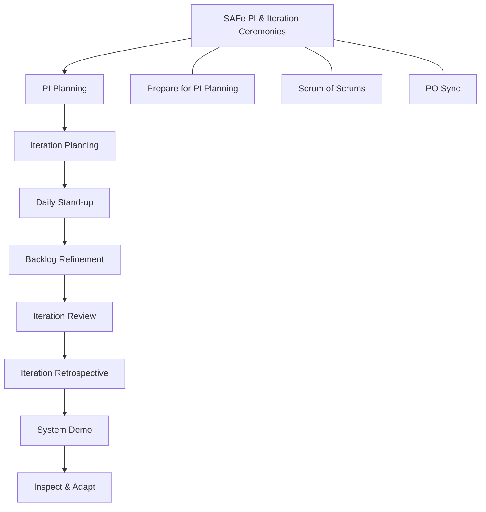

# A Comprehensive 50-Page Manual Covering Essential, Full, and Portfolio SAFe

Welcome to the ultimate guide for the Scaled Agile Framework (SAFe). Whether you’re beginning your Agile transformation or refining a large-scale Agile Release Train (ART), this book covers every aspect—from Essential SAFe basics to the complexities of Full (Large Solution) SAFe and Portfolio SAFe. Use this guide as a reference manual, cookbook, and strategic resource for scaling Agile in your organization.

---

## Table of Contents  
1. **Introduction to Agile and SAFe**  
2. **The Evolution of SAFe**  
3. **SAFe Principles and Core Values**  
4. **Introduction to Essential SAFe**  
5. **Key Components of Essential SAFe**  
6. **Essential SAFe Implementation Roadmap**  
7. **Transitioning to Large Solution SAFe (Full SAFe/Long SAFe)**  
8. **Key Components of Large Solution SAFe**  
9. **Implementing Large Solution SAFe**  
10. **Introduction to Portfolio SAFe**  
11. **Core Elements of Portfolio SAFe**  
12. **Managing Funding and Lean Budgets**  
13. **SAFe Ceremonies: The Cookbook Approach**  
   - Recipe 1: PI Planning  
   - Recipe 2: Iteration Planning  
   - Recipe 3: Daily Stand-up  
   - Recipe 4: Backlog Refinement  
   - Recipe 5: Iteration Review  
   - Recipe 6: Iteration Retrospective  
   - Recipe 7: System Demo  
   - Recipe 8: Inspect & Adapt  
   - Recipe 9: Prepare for PI Planning  
   - Recipe 10: Scrum of Scrums  
   - Recipe 11: PO Sync  
14. **Visual Flow: SAFe Ceremonies Map**  
15. **Additional SAFe Best Practices**  
16. **SAFe Metrics & KPIs**  
17. **Implementing Continuous Delivery Pipeline**  
18. **Quality and DevOps Culture in SAFe**  
19. **Agile Portfolio Management**  
20. **Lean Budgeting and Financial Governance**  
21. **SAFe Governance and Compliance**  
22. **Scaling Agile at the Enterprise Level**  
23. **Case Studies: Essential SAFe Success Stories**  
24. **Case Studies: Full SAFe & Large Solution Success**  
25. **Case Studies: Portfolio SAFe in Action**  
26. **Challenges and Pitfalls in SAFe Adoption**  
27. **Tools and Technologies for SAFe**  
28. **SAFe Training and Certification**  
29. **Building an Agile Center of Excellence**  
30. **Fostering a Culture of Continuous Improvement**  
31. **The Future of SAFe and Scaling Agile**  
32. **Appendix A: Glossary of SAFe Terms**  
33. **Appendix B: SAFe Reference Guides and Links**  
34. **Appendix C: Sample Templates and Checklists**  
35. **Frequently Asked Questions (FAQ)**  
36. **Additional Resources and Reading**  
37. **Conclusion and Next Steps**  

---

## Introduction to Agile and SAFe  
Agile methodologies empower teams to adapt quickly to changing conditions, focus on customer value, and deliver working solutions incrementally. As organizations grow, coordinating Agile practices among multiple teams becomes complex. The Scaled Agile Framework (SAFe) offers a proven, flexible framework for aligning teams, ensuring quality, and accelerating delivery across large enterprises.

In this guide, we walk you through SAFe’s various configurations: Essential SAFe, Full (Large Solution) SAFe, and Portfolio SAFe. Each configuration tailors Agile practices to meet the evolving needs of organizations—from small teams implementing Essential SAFe to enterprises managing complex portfolios.

---

## The Evolution of SAFe  
SAFe has evolved over the years:  
- **Early Agile Methods**: Originated with Scrum and XP for small, co-located teams.  
- **Scaling Challenges**: As organizations grew, new challenges in coordination, quality, and integration emerged.  
- **Birth of SAFe**: Developed to integrate Lean, Agile, and product development flow principles for scalability.  
- **SAFe Today**: Offers multiple configurations—from Essential SAFe to Full and Portfolio SAFe—providing customized approaches based on organizational size, complexity, and strategic needs.  

Understanding this evolution helps in selecting and tailoring the right SAFe configuration for your enterprise.

---

## SAFe Principles and Core Values  
SAFe is built on core principles that drive high performance:  
1. **Alignment**: Ensuring all teams work toward a common business goal.  
2. **Built-in Quality**: Embedding quality throughout the development process.  
3. **Transparency**: Providing visibility into progress and challenges.  
4. **Program Execution**: Focusing on reliable, predictable delivery.  
5. **Lean-Agile Leadership**: Empowering leaders to foster a culture of continuous improvement.  

These principles, along with Lean and Agile values, form the foundation of every SAFe configuration.

---

## Introduction to Essential SAFe  
Essential SAFe is the simplest configuration of SAFe, designed for organizations beginning their Agile transformation journey. It includes the minimum roles, events, and artifacts required to successfully launch an Agile Release Train (ART). Essential SAFe emphasizes:  
- **Team and Program Level**: Focus on delivering value through iterations.  
- **PI Planning**: Synchronizing work across teams.  
- **Agile Ceremonies**: Daily stand-ups, backlog refinement, iteration reviews, and retrospectives.  

Essential SAFe is often the starting point before scaling further into Full or Portfolio SAFe.

---

## Key Components of Essential SAFe  
Essential SAFe includes the following building blocks:  
- **Agile Teams**: Small, cross-functional units that deliver increments.  
- **Agile Release Train (ART)**: A long-lived team of Agile teams that plan, commit, and execute together.  
- **Program Increment (PI)**: An 8–12-week cycle that includes all Agile ceremonies.  
- **Roles**: Scrum Masters, Product Owners, Release Train Engineers (RTE), and System Architects.  
- **Artifacts**: PI Objectives, Program Boards, backlogs, and increment demos.  

These components ensure that teams can work in a coordinated, predictable manner.

---

## Essential SAFe Implementation Roadmap  
Implementing Essential SAFe typically follows a roadmap:  
1. **Training and Mindset Shift**: Educate teams and leaders.  
2. **Launch the ART**: Define teams, roles, and initial backlogs.  
3. **Establish PI Cadence**: Initiate PI Planning and regular iterations.  
4. **Continuous Improvement**: Use Inspect & Adapt sessions to refine practices.  
5. **Monitor and Adapt**: Scale practices based on feedback and metrics.  

This roadmap provides a clear, step-by-step path to Agile transformation using Essential SAFe.

---

## Transitioning to Large Solution SAFe  
When organizations require coordination across multiple ARTs (for example, in complex systems development), they move into Large Solution SAFe. Also known as Full SAFe or Long SAFe, this configuration adds layers to manage:  
- **Multiple ARTs**: Coordination and integration of work across several trains.  
- **Suppliers and Partners**: Managing external contributions.  
- **Specialized Roles**: Including Solution Train Engineers (STE) and additional architects.  

Large Solution SAFe scales the principles of Essential SAFe while introducing additional processes for handling complexity.

---

## Key Components of Large Solution SAFe  
Large Solution SAFe adds new elements such as:  
- **Solution Train**: A structure to synchronize multiple ARTs.  
- **Solution PI Planning**: Planning sessions that align several ARTs.  
- **Roles and Teams**: New roles like Solution Train Engineer and additional Product Management.  
- **Integration and Verification**: Strong emphasis on end-to-end quality and continuous integration across teams.  

These components enable effective management of large, complex solutions that require coordination beyond a single ART.

---

## Implementing Large Solution SAFe  
Implementation steps include:  
1. **Preparation**: Align leadership and define key roles.  
2. **Coordinated Planning**: Conduct cross-ART PI Planning sessions.  
3. **Increment Integration**: Establish robust integration pipelines, demo environments, and continuous testing.  
4. **Governance**: Set up mechanisms for oversight, reporting, and risk management.  

This phase builds on Essential SAFe practices while scaling structure, coordination, and integration.

---

## Introduction to Portfolio SAFe  
Portfolio SAFe brings strategic alignment to the highest level of an organization. It connects enterprise strategy with execution by organizing portfolios of value streams and aligning them with business outcomes. Key characteristics include:  
- **Strategic Themes**: Business goals that drive decision making.  
- **Lean Budgets**: Flexible, adaptive funding models.  
- **Portfolio Kanban**: Visualization of strategy-to-execution flow.  
- **Governance**: Oversight and metrics at the portfolio level.  

Portfolio SAFe ensures that even the largest organizations remain agile and focused on delivering value.

---

## Core Elements of Portfolio SAFe  
Portfolio SAFe encompasses:  
- **Portfolio Vision and Strategy**: Connecting execution with business objectives.  
- **Lean Budgeting and Guardrails**: Funding initiatives within defined constraints.  
- **Epic Owners and Portfolio Backlogs**: Managing and prioritizing strategic initiatives.  
- **Value Streams**: Organizing work around continuous value delivery.  
- **Portfolio Governance**: Regular review of performance metrics and alignment with strategic themes.  

These elements ensure that portfolio-level decisions drive effective, value-focused Agile execution.

---

## Managing Funding and Lean Budgets  
Key practices include:  
- **Dynamic Funding Models**: Shift from project-based to value-stream funding.  
- **Guardrails**: Set boundaries to ensure accountability and value.  
- **Epic Prioritization**: Align budget decisions with strategic imperatives.  
- **Financial Transparency**: Use metrics and dashboards to track performance.  

This approach supports adaptive, value-centric funding at the portfolio level.

---

## SAFe Ceremonies: The Cookbook Approach  
In the spirit of a cookbook, we will now detail step-by-step “recipes” for SAFe ceremonies. Each recipe incorporates ingredients (roles and tools), utensils (formats and methodologies), methods (detailed steps), and results (expected outcomes). The following recipes apply across all SAFe configurations.

### Recipe 1: PI Planning  
**Ingredients**:  
- Release Train Engineer (RTE)  
- Product Management and System Architects  
- Scrum Masters, Product Owners, Agile Teams  
- Business context insights and product vision  

**Utensils**:  
- Conference room or virtual meeting space  
- Digital planning boards and collaboration tools  
- Presentation slides  

**Method**:  
1. **Set the Stage**: Share strategic context, market trends, and product vision.  
2. **Breakout Sessions**: Teams draft their initial plans and identify risks.  
3. **Team Presentations**: Present and align cross-team dependencies.  
4. **Confidence Voting**: Validate shared commitment.  
5. **Finalize Plans**: Create a unified PI plan with clear objectives and a Program Board.  

**Results**:  
- Agreed-upon PI Objectives  
- A comprehensive Program Board capturing milestones, dependencies, and features  

---

### Recipe 2: Iteration Planning  
**Ingredients**:  
- Scrum Master  
- Product Owner  
- Agile Team  
- Prioritized product backlog  

**Utensils**:  
- Task boards and estimation tools (e.g., planning poker)  
- Digital or physical agile boards  

**Method**:  
1. **Backlog Review**: Identify and select appropriate backlog items.  
2. **Task Breakdown**: Decompose user stories into tasks.  
3. **Risk Identification**: Surface technical risks and dependencies.  
4. **Set a Goal**: Agree on a concise iteration goal.  

**Results**:  
- A clear iteration goal  
- A committed backlog and actionable tasks for the upcoming iteration  

---

### Recipe 3: Daily Stand-up  
**Ingredients**:  
- Agile team members  
- Scrum Master (facilitator)  

**Utensils**:  
- Timer (15 minutes)  
- Stand-up meeting (physical or virtual)  

**Method**:  
1. **Round-Robin Updates**: Each member answers:  
   - What did I do yesterday?  
   - What will I do today?  
   - Any blockers?  
2. **Impediment Logging**: Note blockers for follow-up.  

**Results**:  
- Daily team alignment and focus  
- Early resolution of impediments  

---

### Recipe 4: Backlog Refinement  
**Ingredients**:  
- Product Owner  
- Agile Team  
- Optionally, a Scrum Master  

**Utensils**:  
- Backlog management tools (Jira, Azure DevOps)  
- Whiteboard or digital collaboration space  

**Method**:  
1. **Review Backlog**: Eliminate ambiguities and reprioritize items.  
2. **Story Splitting**: Break larger stories into smaller, actionable pieces.  
3. **Estimation**: Re-assess estimates and add clarity.  
4. **Pruning**: Remove obsolete items.  

**Results**:  
- A well-defined, prioritized product backlog  
- Improved planning accuracy for iterations  

---

### Recipe 5: Iteration Review  
**Ingredients**:  
- Agile Team (presenters)  
- Product Owner  
- Stakeholders  

**Utensils**:  
- Demo environment or staging area  
- Presentation tools (screensharing, projector)  

**Method**:  
1. **Live Demo**: Showcase completed features.  
2. **Feedback Session**: Gather stakeholder insights.  
3. **Backlog Update**: Reflect new requirements as needed.  

**Results**:  
- Engagement and immediate feedback  
- Updated product backlog reflecting potential changes  

---

### Recipe 6: Iteration Retrospective  
**Ingredients**:  
- Agile Team members  
- Scrum Master (facilitator)  

**Utensils**:  
- Whiteboard or digital collaboration tool (Miro, MURAL)  
- Retrospective templates (e.g., Start, Stop, Continue)  

**Method**:  
1. **Discussion**: Identify what went well and what can improve.  
2. **Structured Format**: Use a structured method to capture insights.  
3. **Action Items**: Prioritize improvements and assign owners.  

**Results**:  
- Clear improvement action items  
- Enhanced team collaboration and continuous improvement culture  

---

### Recipe 7: System Demo  
**Ingredients**:  
- All Agile Teams  
- Product Management  
- RTE and System Architects  

**Utensils**:  
- Integrated demo environment  
- Collaboration and demo sharing tools  

**Method**:  
1. **Collect Artifacts**: Integrate outputs from all teams.  
2. **Live Demo**: Present integrated functionality.  
3. **Feedback**: Capture stakeholder comments for next iterations.  

**Results**:  
- Demonstrated cross-team integration  
- Aligned understanding of current system status  

---

### Recipe 8: Inspect & Adapt  
**Ingredients**:  
- Entire Agile Release Train (ART)  
- RTE (facilitator)  
- Leaders, Scrum Masters, and Product Owners  

**Utensils**:  
- Metrics dashboards  
- Workshop tools (flip charts, digital boards)  

**Method**:  
1. **PI System Demo**: Start with a comprehensive demonstration.  
2. **Metrics Analysis**: Review quantitative/qualitative metrics.  
3. **Problem-Solving Workshop**: Identify systemic issues and solutions.  
4. **Improvement Backlog**: Create and commit to improvement actions.  

**Results**:  
- A prioritized improvement backlog  
- Adjusted practices and enhanced process maturity  

---

### Recipe 9: Prepare for PI Planning  
**Ingredients**:  
- Product Management  
- Architects  
- Scrum Masters and Agile Teams  

**Utensils**:  
- Feature backlog management tools  
- Templates for capacity planning and risk assessment  

**Method**:  
1. **Backlog Finalization**: Refine and prioritize features.  
2. **Capacity Analysis**: Evaluate and confirm team capacity.  
3. **Risk and Dependency Identification**: Document potential obstacles.  
4. **Architectural Review**: Address any needed structural concerns.  

**Results**:  
- A fine-tuned feature backlog  
- Clear insights on capacity and risks, ensuring readiness for PI Planning  

---

### Recipe 10: Scrum of Scrums  
**Ingredients**:  
- Representatives (typically Scrum Masters) from multiple teams  
- RTE (facilitator)  

**Utensils**:  
- Scheduled meeting platform (virtual/in-person)  
- Collaboration tools for tracking issues  

**Method**:  
1. **Update Sharing**: Each rep shares brief status updates.  
2. **Identify Cross-Team Dependencies**: Highlight any obstacles affecting multiple teams.  
3. **Resolve Issues**: Discuss and assign action items.  
4. **Summarize**: Confirm follow-up items.  

**Results**:  
- Alignment across teams  
- Early resolution of cross-team blockers  

---

### Recipe 11: PO Sync  
**Ingredients**:  
- Product Owners  
- Product Management  
- Optionally, the RTE  

**Utensils**:  
- Digital backlog or synergy tools  
- Scheduling platform for recurring meetings  

**Method**:  
1. **Status Review**: Evaluate the progress of key backlog items.  
2. **Align Priorities**: Reconcile differences between teams.  
3. **Plan Adjustments**: Update the backlog for upcoming iterations.  
4. **Document**: Log action items and decisions.  

**Results**:  
- Harmonized priorities between Product Owners and Management  
- A well-maintained and prioritized backlog  

---

## Visual Flow: SAFe Ceremonies Map  
Below is a Mermaid diagram that connects all the ceremony recipes in a holistic SAFe process:  

Use this diagram to visualize how each ceremony feeds into the overall SAFe process.

---

## Additional SAFe Best Practices  
- **Preparation**: Ensure all roles have clarity and all tools are set before ceremonies.  
- **Regular Reviews**: Continuously refine your processes using retrospective feedback.  
- **Visual Management**: Use dashboards and diagrams to enhance transparency.  
- **Customization**: Adapt ceremonies to suit your organization’s maturity and needs.  
- **Continuous Training**: Invest in training for all levels of staff.  
- **Documentation**: Maintain records from all ceremonies to track progress and insights.  

---

## SAFe Metrics & KPIs  
Key performance indicators in a SAFe environment include:  
- **PI Predictability**: Ratio of planned vs. delivered work.  
- **Quality Metrics**: Defect rates and customer-reported issues.  
- **Team Velocity**: Consistency in story points delivered.  
- **Flow Efficiency**: Time from work initiation to completion.  
- **Business Value**: Alignment of delivered features with strategic themes.  

Establishing clear metrics guides continuous improvement and accountability.

---

## Implementing a Continuous Delivery Pipeline  
A strong continuous delivery pipeline is essential in SAFe. Focus on:  
- **Automated Testing**: Integrate continuous testing in every sprint.  
- **Continuous Integration**: Merge code regularly to reduce integration issues.  
- **Continuous Deployment**: Automate deployment to multiple environments.  
- **Monitoring**: Use tools to measure performance and detect issues early.  

This pipeline supports rapid feedback and high-quality releases.

---

## Quality and DevOps Culture in SAFe  
Trusted quality and DevOps practices are vital for SAFe success:  
- **Built-in Quality**: Prioritize quality at every stage.  
- **DevOps Practices**: Incorporate continuous integration and delivery.  
- **Collaboration**: Encourage shared responsibilities between development and operations.  
- **Automated Monitoring**: Use monitoring tools to ensure system integrity.  

A robust culture ensures that speed does not come at the cost of quality.

---

## Agile Portfolio Management  
At the portfolio level, management adjusts:  
- **Strategic Alignment**: Connect portfolio initiatives to business strategy.  
- **Value Streams**: Organize work around continuous value delivery.  
- **Visibility**: Use portfolio Kanban boards to track epic progression.  
- **Feedback Loops**: Ensure regular portfolio reviews with leadership.  

This structure ensures strategic initiatives are tracked and prioritized effectively.

---

## Lean Budgeting and Financial Governance  
Portfolio SAFe emphasizes:  
- **Dynamic Funding**: Shift from traditional project funding to lean budgeting.  
- **Guardrails**: Define principles that govern financial decisions.  
- **Transparency**: Create financial dashboards for real-time insights.  
- **Iterative Reviews**: Adapt budgets based on performance feedback.  

These practices enable value-focused, adaptable funding management.

---

## SAFe Governance and Compliance  
Governance in SAFe involves:  
- **Oversight**: Regular reviews of performance, budget, and risk.  
- **Compliance**: Ensure that regulatory requirements are met.  
- **Decentralized Decision Making**: Balance autonomy with accountability.  
- **Reporting**: Utilize dashboards to inform stakeholders on portfolio health.  

Effective governance maintains accountability while fostering innovation.

---

## Scaling Agile at the Enterprise Level  
To scale Agile:  
- **Cultural Shift**: Encourage a shift towards continuous improvement.  
- **Cross-functional Teams**: Empower teams to work collaboratively.  
- **Leadership Engagement**: Leaders must champion and support Agile practices.  
- **Institutionalize Learning**: Create feedback loops at every level.  

These strategies help navigate the complexities of enterprise-scale transformations.

---

## Case Studies: Essential SAFe Success Stories  
**Case Study 1**:  
A mid-sized organization adopted Essential SAFe to align 3 Agile teams. They experienced:  
- Improved communication and transparency.  
- A 20% increase in iteration velocity.  
- Faster customer feedback cycles.  

**Key takeaway**: Starting small with Essential SAFe can build critical momentum.

---

## Case Studies: Full SAFe & Large Solution Success  
**Case Study 2**:  
A global enterprise implemented Large Solution SAFe across 5 ARTs. Their experience included:  
- Enhanced cross-team integration.  
- Streamlined PI Planning across multiple teams.  
- Improved quality through structured integration testing.  

**Key takeaway**: Scaling to Full SAFe requires robust coordination and governance, but delivers significant strategic advantages.

---

## Case Studies: Portfolio SAFe in Action  
**Case Study 3**:  
An enterprise restructured its portfolio using Portfolio SAFe:  
- Realigned projects with strategic themes.  
- Implemented lean budgeting and agile portfolio management.  
- Noted improved financial performance and faster time-to-market.  

**Key takeaway**: Portfolio SAFe bridges strategy and execution for large organizations.

---

## Challenges and Pitfalls in SAFe Adoption  
Common pitfalls include:  
- **Resistance to Change**: Teams may resist new frameworks.  
- **Lack of Training**: Insufficient training can hinder adoption.  
- **Tooling Gaps**: Inadequate tools can slow down processes.  
- **Over-Engineering**: Excessive process overhead may stifle agility.  

Addressing these challenges requires leadership, robust training programs, and continuous process improvement.

---

## Tools and Technologies for SAFe  
Popular tools supporting SAFe include:  
- **Agile Project Management**: Jira, Rally, VersionOne.  
- **Collaboration Tools**: Microsoft Teams, Slack, Miro.  
- **DevOps Tools**: Jenkins, Azure DevOps, GitLab.  
- **Metrics & Reporting**: Tableau, PowerBI, custom dashboards.  

Selecting the right mix of tools accelerates value delivery and collaboration.

---

## SAFe Training and Certification  
Invest in SAFe training to:  
- Build a common language and understanding.  
- Certify key roles (e.g., SAFe Agilist, SAFe Practitioner).  
- Accelerate transformation with knowledgeable champions.  

Certification and training programs empower teams and leadership to drive the Agile transformation.

---

## Building an Agile Center of Excellence  
An Agile Center of Excellence (CoE):  
- Coordinates training and best practices.  
- Shares lessons learned across the organization.  
- Drives continuous improvement and innovation.  

Establishing a CoE fosters long-term, sustainable transformation.

---

## Fostering a Culture of Continuous Improvement  
Key strategies include:  
- **Regular Retrospectives**: Create feedback loops for constant refinement.  
- **Metrics**: Use data to drive decisions.  
- **Empowerment**: Encourage teams to innovate and experiment.  
- **Learning Mindset**: Promote ongoing training and knowledge sharing.  

A continuous improvement culture is crucial for long-term success in SAFe.

---

## The Future of SAFe and Scaling Agile  
Innovations in SAFe include:  
- Greater integration of AI and data analytics for decision making.  
- Enhanced automation in CI/CD pipelines.  
- Evolving leadership models that empower autonomous teams.  
- Increased focus on customer-centric approaches in portfolio management.  

Emerging trends will further transform how organizations scale Agile.

---

## Appendix A: Glossary of SAFe Terms  
- **ART (Agile Release Train)**: A long-lived team of Agile teams.  
- **PI (Program Increment)**: A timeboxed period for planning and execution.  
- **Lean Budgeting**: Flexible budgeting principles in SAFe.  
- **Epic**: A large body of work that drives value.  
- **Solution Train**: A coordination mechanism for multiple ARTs.  
*(And many more…)*  

This glossary provides definitions for key SAFe terminology.

---

## Appendix B: SAFe Reference Guides and Links  
- [SAFe Website](https://www.scaledagileframework.com/)  
- [SAFe Implementation Roadmap](https://www.scaledagileframework.com/implementation-roadmap/)  
- [SAFe Glossary](https://www.scaledagileframework.com/glossary/)  
- [Leading SAFe Training](https://www.scaledagile.com/leading-safe/)  

Additional reference documents and eBooks can be found on the official SAFe site.

---

## Appendix C: Sample Templates and Checklists  
This section includes downloadable templates for:  
- PI Planning agendas  
- Iteration planning boards  
- Retrospective feedback forms  
- Portfolio Kanban boards  
- Lean budgeting checklists  

Use these resources to standardize your processes and documentation.

---

## Frequently Asked Questions (FAQ)  
**Q1: What is the primary benefit of SAFe?**  
A1: SAFe aligns strategy with execution, ensuring that even large organizations deliver value reliably.  

**Q2: How do I choose between Essential, Full, and Portfolio SAFe?**  
A2: Essential SAFe is best for initial agile transformations; Full SAFe is suited for complex, multi-team environments; Portfolio SAFe is for strategic alignment across the enterprise.  

**Q3: What are the key metrics to track?**  
A3: Metrics include PI predictability, team velocity, defect density, flow efficiency, and business value metrics.  

*(Additional FAQs are addressed in this section.)*  

---

## Additional Resources and Reading  
- Books on Agile and SAFe methodologies  
- Webinars and podcasts from SAFe experts  
- Community groups and LinkedIn forums for SAFe practitioners  
- Latest industry insights and case studies from leading enterprises  

